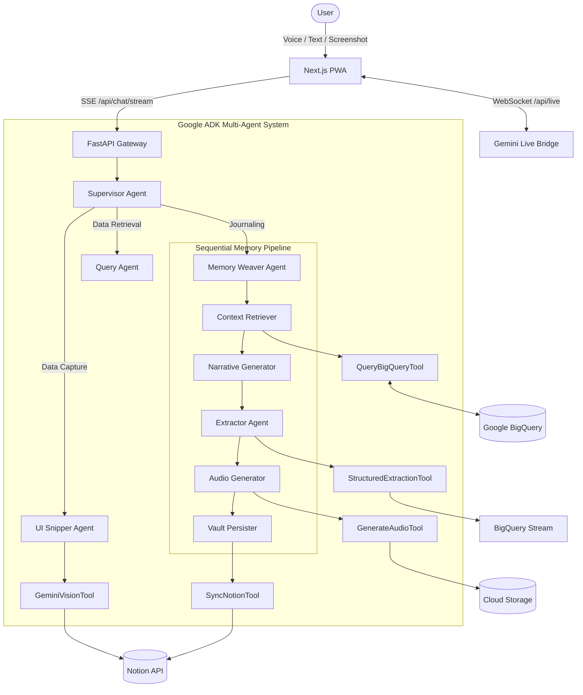

# MemoriaOS — The Multimodal Second Brain

[](https://cloud.google.com/)
[](https://deepmind.google/technologies/gemini/)
[](https://nextjs.org/)
[](https://web.dev/progressive-web-apps/)

MemoriaOS is a **next-generation, multimodal Life OS agent** — an omniscient personal assistant that sees what you see, hears what you feel, and transforms messy, unstructured life inputs into beautifully organised, rich-media knowledge databases.

Developed for the **Google Gemini Live Agent Challenge**, it represents the evolution of personal AI from simple chat-bots to proactive, multimodal life companions.

---

## 🌟 Project Vision

MemoriaOS operates on a unique **Tri-Engine architecture**:

1.  **Engine 1 — The Internal Engine (Creative Storyteller):** Processes emotional narratives (voice/text). It weaves your thoughts with past context retrieved from BigQuery and generates a multimodal response: cinematic text + AI-generated mood imagery + ambient audio.
2.  **Engine 2 — The External Engine (UI Navigator):** Processes visual inputs (screenshots). It visually parses complex UIs — recipes, bank statements, workouts — and extracts structured data directly into Notion without requiring APIs.
3.  **Engine 3 — The Live Engine (Live Agent):** A real-time, interruptible voice assistant powered by the **Gemini Live API**. Talk to MemoriaOS naturally while on the move with real-time waveform visualization.

---

## 🏗️ Full Architecture

MemoriaOS leverages a sophisticated **multi-agent orchestration** powered by the **Google ADK**.



---

## 🚀 Key Features

*   **Cinematic Narrative Reveal**: Server-Sent Events (SSE) stream text, mood images, and audio as they are generated for a "live thinking" effect.
*   **Sequential Memory Weaving**: A 5-step pipeline that retrieves context, creates narratives, extracts structured metrics (sleep, fitness, finance), synthesizes audio, and persists to the vault.
*   **UI Navigator (Vision)**: Take a screenshot of a recipe or receipt; MemoriaOS parse the pixels and saves it to Notion flawlessly.
*   **Memory Reels**: Weekly audiovisual summaries of your life highlights using FFmpeg and Gemini.
*   **Gemini Live API**: High-fidelity, low-latency voice interaction with a premium **Waveform Visualizer**.
*   **Premium PWA Experience**: Glassmorphism design, desktop sidebar, mobile bottom-nav, and fluid Framer Motion animations.

---

## 🛠️ Engineering Standards

MemoriaOS is built with industrial-grade engineering practices:

*   **Google ADK**: Native implementation of `SequentialAgent`, `LlmAgent`, and `LoopAgent` with automated error escalation.
*   **Pydantic v2**: Strict validation for 15+ complex life domains and structured extraction schemas.
*   **Slotted Dataclasses**: Optimized internal state management for high-performance agent execution.
*   **Async/Await Native**: All I/O (BigQuery, GCS, Notion, Gemini) is non-blocking using `asyncio.to_thread` for legacy SDKs.
*   **Google Python Style**: Comprehensive docstrings, strict type hinting, and Ruff/Mypy validation.

---

## 🚀 How to Run

### 1. Prerequisites
*   Python 3.11+
*   Node.js 18+ (Next.js 14)
*   **GCP Project**: Enable Vertex AI, BigQuery, GCS, TTS.
*   **Notion**: Integration secret and Domain Page IDs (`NOTION_WELLNESS_PAGE_ID`, `NOTION_FINANCE_PAGE_ID`, etc.).

### 2. Quick Start (Local)
```bash
# Clone and enter
git clone https://github.com/vaibhavd030/MemoriaOS.git
cd MemoriaOS

# Setup Backend
cd backend
python -m venv venv && source venv/bin/activate
pip install -e .
cp .env.example .env # Fill keys
uvicorn main:app --port 8080 --reload

# Setup Frontend
cd ../frontend
npm install
npm run dev
```

### 3. Deployment (Cloud Run)
```bash
# Ensure GCP_PROJECT_ID, GOOGLE_API_KEY, NOTION_API_KEY are in your environment
./deploy.sh
```

---

## 📖 How to Use

1.  **Multimodal Chat**: Use the central orb to type or upload images. Watch the SSE stream weave your memory.
2.  **Knowledge Vault**: Visit the Vault to see structured counts of your media, documents, and extracted data.
3.  **Life Journal**: Review your past entries with rich formatting and ambient audio playback.
4.  **Weekly Reels**: View generated highlight videos in the Reels section.

---

**Built by [Vaibhav Dikshit](https://github.com/vaibhavd030) for the Google Gemini Live Agent Challenge.**
