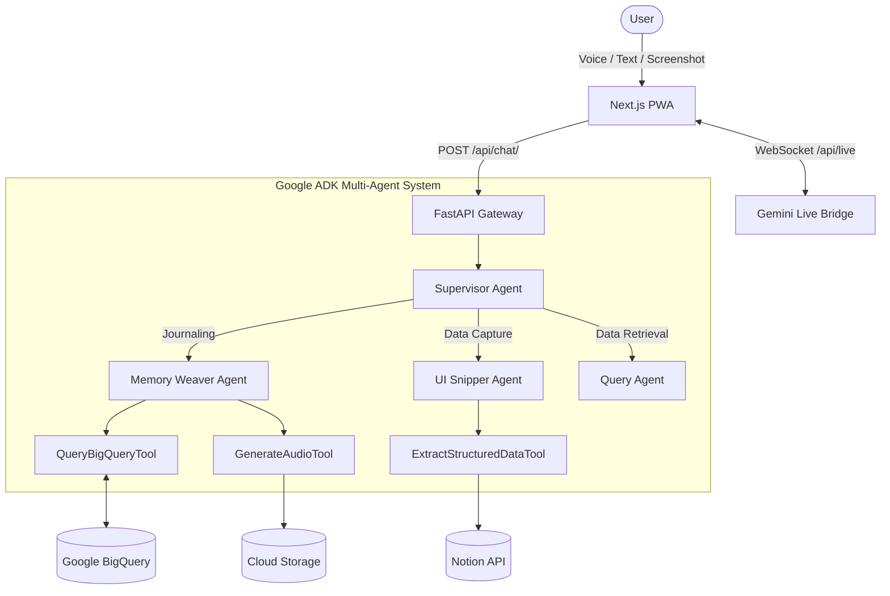

# MemoriaOS — The Multimodal Second Brain

[](https://cloud.google.com/)
[](https://deepmind.google/technologies/gemini/)
[](https://nextjs.org/)

MemoriaOS is a **next-generation, multimodal Life OS agent** — an omniscient personal assistant that sees what you see, hears what you feel, and transforms messy, unstructured life inputs into beautifully organised, rich-media knowledge databases.

Developed for the **Google Gemini Live Agent Challenge**, it represents the evolution of personal AI from simple chat-bots to proactive, multimodal life companions.

---

## 🌟 Project Vision

MemoriaOS operates on a unique **Tri-Engine architecture**:

1.  **Engine 1 — The Internal Engine (Creative Storyteller):** Processes emotional narratives (voice/text). It weaves your thoughts with past context retrieved from BigQuery and generates a multimodal response: narrative text + AI-generated mood image + ambient audio.
2.  **Engine 2 — The External Engine (UI Navigator):** Processes visual inputs (screenshots). It visually parses complex UIs — recipes, bank statements, workouts — and extracts structured data directly into Notion without requiring APIs.
3.  **Engine 3 — The Live Engine (Live Agent):** A real-time, interruptible voice assistant powered by the **Gemini Live API**. Talk to MemoriaOS naturally while on the move.

---

## 🏗️ Full Architecture



---

## 🚀 Key Features

*   **Cinematic Narrative Reveal**: Server-Sent Events (SSE) stream text, mood images, and audio as they are generated for a "live thinking" effect.
*   **Multimodal Journaling**: Interleaved text, AI-generated watercolours, and ambient audio summaries.
*   **UI Navigation**: Take a screenshot of a recipe or receipt; MemoriaOS extracts it perfectly.
*   **Memory Reels**: Weekly audiovisual summaries of your life highlights using FFmpeg and Gemini.
*   **Google Photos Enrichment**: Automatically syncs your daily photos to enrich your memories.
*   **Gemini Live API**: Real-time voice interaction with high-fidelity low-latency responses.

---

## 🛠️ How to Run

### Prerequisites
*   Python 3.11+ (managed by `uv` recommended)
*   Node.js 18+
*   Google Cloud Project with Vertex AI and BigQuery enabled.
*   Notion API Key.

### 1. Backend Setup
```bash
cd memoria_os/backend
uv sync
cp .env.example .env  # Fill in your GOOGLE_API_KEY and GCP details
uv run uvicorn main:app --reload
```

### 2. Frontend Setup
```bash
cd memoria_os/frontend
npm install
npm run dev
```

### 3. Infrastructure (Optional)
```bash
cd infra
terraform init
terraform apply
```

---

## 📖 How to Use

1.  **Write/Speak**: Use the "Write" tab to dump your thoughts. Experience the storyteller weaving your journal.
2.  **Snap**: Upload a screenshot of a transaction or workout. Check your **Knowledge Vault** (or Notion) for the result.
3.  **Live**: Tap the microphone to start a Gemini Live session. Talk freely; MemoriaOS will track your tasks and metrics in real-time.
4.  **Reels**: Visit the "Reels" tab every Sunday to see your generated life highlight video.

---

## 🛡️ Engineering Standards

*   **Pydantic v2**: Strict validation for all 15+ life domains.
*   **Google ADK**: Modular multi-agent orchestration.
*   **OpenTelemetry**: Native tracing and observability.
*   **Async/Await**: Non-blocking I/O for all integrations.

---

**Built with ❤️ for the Google Gemini Live Agent Challenge.**
